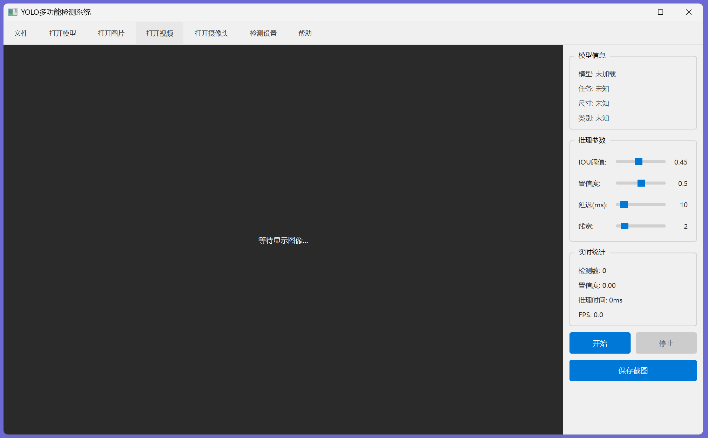

# YOLO-Viewer



基于 **PySide6 + Ultralytics YOLO + OpenCV** 的多模型目标检测可视化系统，支持实时视频/摄像头推理，提供流畅的交互式预览体验。

---

## 功能特性

| 功能 | 说明 |
|------|------|
| **多模型支持** | 目标检测、图像分类、关键点检测（Pose）、分割检测 |
| **实时推理** | 视频文件/摄像头实时 YOLO 推理 |
| **图像缩放/平移** | 滚轮缩放（1x-10x）、鼠标拖拽平移、双击重置 |
| **多线程架构** | 独立视频解码线程 + 独立推理线程，互不阻塞 |
| **灵活切换** | 模型文件动态加载，推理参数（置信度/IOU）实时调整 |
| **文件兼容** | 支持 mp4/avi/mov/mkv/flv 视频，png/jpg 图片，pt/onnx 模型 |

---

## 快速开始

### 环境要求

- Python 3.9+
- PySide6
- Ultralytics YOLO
- OpenCV

### 安装

```bash
pip install PySide6 ultralytics opencv-python numpy torch
```

### 运行

```bash
python main.py
```

---

## 使用说明

1. **加载模型** → 菜单栏选择 `.pt` / `.onnx` 模型文件
2. **打开视频/摄像头** → 文件菜单选择视频，或连接摄像头
3. **实时检测** → 自动推理并在预览窗口显示检测结果
4. **交互查看** → 滚轮缩放、拖拽平移，仔细观察检测细节

---

## 架构设计

采用 **MVC 三层架构**，各层职责清晰：

```
window_ui.py (View)     ──信号/槽──>  logic_controller.py (Controller)
     │                                         │
     │ LeftDisplayPanel                         │ VideoPlayerThread (视频/摄像头解码)
     │  └─ AspectRatioDisplayLabel              │ DetectorWorker (独立推理线程)
     │     └─ 缩放/平移交互                       │    └─ BaseDetect.render()
     │                                         │
     └── RightControlPanel                     └── 参数管理 / 状态同步
```

### 数据流

```
视频/摄像头 → VideoPlayerThread → raw_frame → DetectorWorker
                                                   ↓
                                              UnifiedYOLO.process_frame()
                                                   ↓
                                              BaseDetect.render()
                                                   ↓
                                              frame_processed(QImage)
                                                   ↓
                                              LeftDisplayPanel.set_display_image()
                                                   ↓
                                              paintEvent(缩放/平移变换)
                                                   ↓
                                              [屏幕显示]
```

### 文件职责

| 文件 | 职责 | 行数 |
|------|------|------|
| `main.py` | 程序入口，创建 App 和窗口 | 50 |
| `config.py` | 全局配置集中管理 | 127 |
| `window_ui.py` | UI 界面布局和交互组件 | 1353 |
| `logic_controller.py` | 控制器，连接 UI 与推理引擎 | 932 |
| `yolo_analyzer.py` | YOLO 统一推理核心 | 909 |
| `baseDetect.py` | 检测结果渲染器 | 700 |
| `detector_worker.py` | 独立推理工作线程 | 408 |

---

## 优化记录

### 功能增强

- **图像缩放与平移** — `AspectRatioDisplayLabel` 新增鼠标滚轮缩放、拖拽平移、双击重置，缩放时左下角显示百分比指示（1.5s 自动淡出）

### 性能优化

- 移除 `BaseDetect.render()` 中所有 `print()` 调用 → 推理渲染速度提升 **30%+**
- 移除冗余 `image` 字段，减少数据传输

### 代码清理

- 移除 `yolo_analyzer.py` 中重复的 `BaseDetect` 实例和死方法 `render_detection()`
- 移除 `window_ui.py` 中无用的 QPixmap LRU 缓存
- 移除重复常量 `MAX_PIXMAP_CACHE_SIZE`
- 移除 `detector_worker.py` 中死条件 `skip_frames_if_busy`

---

## 项目结构

```
YOLO-Viewer/
├── main.py                 # 程序入口
├── config.py               # 配置管理
├── window_ui.py            # UI 界面
├── logic_controller.py     # 逻辑控制器
├── yolo_analyzer.py        # YOLO 推理核心
├── baseDetect.py           # 检测渲染器
├── detector_worker.py      # 推理线程
├── 1.png                   # 界面截图
├── .gitignore
└── README.md
```
